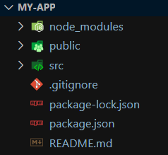
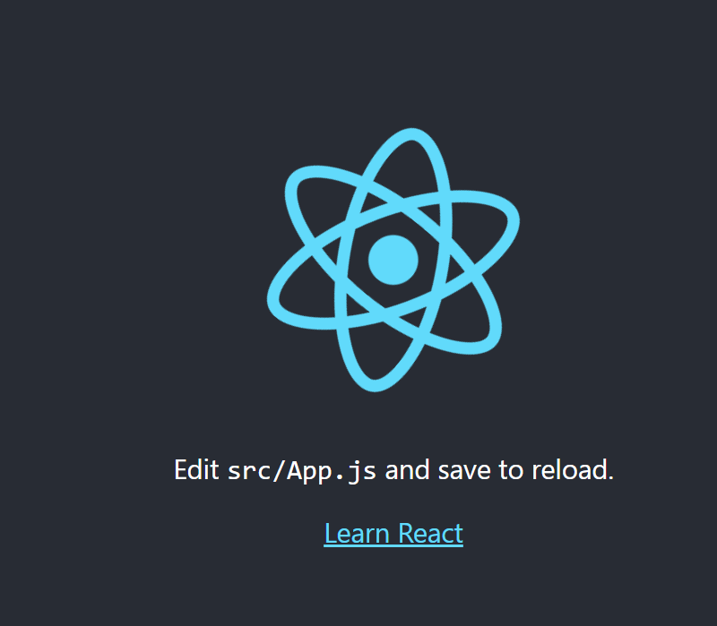
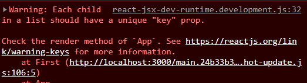

# React.js

## Wstęp

React.js jest biblioteką służącą do budowania elastycznych i rozbudowanych aplikacji internetowych, z pojedyńczych "klocków" nazywanych komponentami. W poniższym wpisie dowiesz się co to komponent i jak go wykorzystywać. <br />
Za pomocą Reacta możemy tworzyć aplikacje internetowe, ale też desktopowe z pomocą Electron.js, a także aplikacje mobilne za pomocą React Native. Szerokie zastosowanie tej biblioteki sprawia, że React jest popularnym frameworkiem i dzięki jego znajomości łatwo znaleźć nową wymarzoną pracę. <br />

### Co to React i skąd się wziął?

React jest biblioteką stworzoną do budowania interfejsów w JavaScript. Powstał w "stajni" firmy Facebook (obecnie Meta). React opiera się na takich wzorcach programistycznych jak budowanie aplikacji w oparciu o komponenty, jednokierunkowy przepływ danych. <br />
Dużą zaletą Reacta jest jego ogromna społeczność. Do wielu typowych zadań do wykonania powstały paczki, które ułatwiają innym programistom/tkom pracę. Wszystkie paczki są dostępne na stronie [npm](https://www.npmjs.com/). Społeczność pomoże nam wybrać odpowiednie rozwiązania. Dzięki możliwości doboru dowlonego rozwiązania stajemy się elastyczni i ciągle uczymy się czegoś nowego. Przy okazji rozwiązania te konkurują pomiędzy sobą co sprawia, że powstałe paczki dążą ciągle do gonienia za konkurencją, a przez to stają się lepsze, szybsze i przyjemniejsze w użytkowaniu.

### Virtual DOM

React wykorzystuje mechanizm virtual DOM, który pozwala na renderowanie w przeglądarce i aktualizowanie tylko tych fragmentów strony która się zmieniła pomiędzy przerenderowaniami. Virtual DOM to model rzeczywistego DOMu tyle, że w pamięci. Dzięki możliwości operacji na DOMu w pamięci, a później aktualizacji prawdziwego DOMu renderowanie staje się szybsze niż kiedykolwiek wcześniej.

### Create React App (CRA)

Create react app jest skryptem dzięki któremu możliwa jest inicjalizacja szablonu aplikacji Reactowej. Użycie CRA zmniejsza ilość czasu potrzebnego na inicjalizację i wstępną konfigurację projektu. Aby móc korzystać z CRA najpierw zainstalujmy je poprzez terminal poleceniem:

```js
npm install -g create-react-app
```

flaga -g oznacza że instalujemy skrypt globalnie<br />
Nadszedł teraz moment na który oboje czekaliśmy, czyli stworzysz swoją pierwszą aplikację w React. W terminalu wpisz (w miejsce nazwa-apki możesz podać swoją nazwę):

```
npx create-react-app nazwa-apki
```

Sam CRA posiada też możliwość korzystania z bardziej rozbudowanych szablonów wtedy po nazwie aplikacji dopisujemy np. `--template typescript`<br/>
ten template pozwoli nam na stworzenie aplikacji ze skonfigurowanym wstępnie TypeScriptem. Jeśli chcesz dowiedzieć się o tym więcej zachęcam do przeczytania dokumentacji [CRA](https://create-react-app.dev/docs/getting-started) <br/>

Aby zacząć działać z React należy otworzyć stworzony przez CRA folder można to zrobić z poziomu terminala

`cd nazwa-apki`<br/>
`code .`

### Co powstało z standardowego boilerplate?

<br />

- Folder node_modules odpowiada za przechowywanie wszystkich paczek zewnętrznych używanych w projekcie,
- public zawiera:
  - plik index.html, w którym montuje się nasza aplikacja (w div o id root),
  - favicon, który jest ikoną,
  - pliki logo,
  - manifest.json przechowuje informacje o aplikacji np. nazwę autora, wykorzystywany do instalacji aplikacji jako skrót (np. na pulpicie) w urządzeniach mobilnych,
  - robots.tsx informacje dla robotów
- plik .gitignore - służący do zarządzania wysyłaniem plików na gita,
- package-lock.json - plik automatycznie generowany podczas operacji wykonywanych przez npm, które modyfikują folder node_modules,
- package.json - plik zawierający nazwę, wersję, zależności, skrypty i konfigurację aplikacji,
  - browserlist oznacza jakie przeglądarki zamierzamy wspierać za pomocą naszej aplikacji,
  - oprócz klucza dependencies można też zdefiniować klucz devDependencies, który oznacza zależności (paczki), które są używane tylko podczas procesu rozwoju aplikacji przez developerów,
- README.md - plik w formacie markdown, w którym powinien się znaleźć opis projektu i najważniejsze informacje o nim,
- src folder który zawiera pliki źródłowe, w nim będziemy tworzyć naszą aplikację internetową, należy zwrócić uwagę na pliki:
  - index.css - tutaj powinien znaleźć się globalny reset styli i style globalne,
  - App.js - to nasz pierwszy komponent,
  - index.js - serce naszej aplikacji
  - setupTests.js - plik konfiguracyjny testów,
  - reportWebVitals.js - plik konfiguracyjny służący do mierzenia metryk aplikacji <br />

Przyjrzyjmy się bliżej sercu aplikacji, czyli plikowi index.js:

```js
import React from "react"; // importujemy paczki
import ReactDOM from "react-dom/client";
import "./index.css";
import App from "./App";
import reportWebVitals from "./reportWebVitals";

const root = ReactDOM.createRoot(document.getElementById("root")); //tworzymy w DOMu korzeń (root naszej aplikacji), aplikacja zostanie wstrzyknięta w index.html, w element o id root
root.render(
  <React.StrictMode>
    <App />
  </React.StrictMode>
); // na utworzonym obiekcie root, renderujemy komponent App, w StrictMode
```

Więcej o React.StrictMode przeczytasz w [dokumentacji](https://pl.reactjs.org/docs/strict-mode.html)

### Pierwsze uruchomienie

Aby ruchomić Reacta w przeglądarce używamy w terminalu komendy

`npm start`<br/>

Po otworzeniu adresu localhost:3000 naszym oczom ukarze się domyślny widok aplikacji Reactowej.



### Różnica pomiędzy js a jsx/ts a tsx

Zaraz przejdziemy do omówienia jak stworzyć swój pierwszy komponent, ale najpierw chciałbym omówić różnicę pomiędzy rozszerzeniem pliku .js a .jsx.

Rozszerzenie JSX łączy w sobie kod JS z kodem HTML, więc z plików z rozszerzeniem JSX korzystamy, gdy chcemy definiować wygląd i zachowanie widoku (UI). Dla Reacta nie ma znaczenia czy używasz rozszerzenia .js czy .jsx, ale niektóre wtyczki vscode lepiej współpracują z plikami .jsx. Taka sama różnica występuje pomiędzy plikami z rozszerzeniem .ts i .tsx.

### Tworzenie komponentów

Na początek jeszcze warto wspomnieć czym jest komponent. Komponent jest funkcją, która zwraca kawałek kodu HTML wraz z logiką. W niniejszym pliku, będziemy korzystać zgodnie ze standardami komercyjnymi z komponentów funkcyjnych. O komponentach klasowych opowiem przy okazji hooków, gdy będziemy mówić o cyklu życia komponentu

Zacznijmy od stworzenia pierwszego komponentu, tworzymy nowy plik z rozszerzeniem .jsx np. Pierwszy.jsx w folderze src

```js
export const First = () => {
  //eksportujemy funkcję żeby później jej użyć
  return <div>Hello world!</div>;
};
```

w pliku App.js importujemy komponent First i go używamy

```js
import { First } from "./First";

function App() {
  return <First />;
}

export default App;
```

Na podglądzie w przeglądarce po wprowadzeniu zmian powinien ukazać się widok


### Reużywalność komponentów

Komponenty mogą być używane wewnątrz innych komponentów i używane wielokrotnie na jednym widoku. Komponent zawsze musi zwracać jeden fragment widoku, więc musimy opakować kilka komponentów w diva lub React.Fragment, czyli puste <></>. Wykorzystanie React.Fragment zamiast diva pozwala na zmniejszenie ilości zagnieżdżeń w DOMu.

```js
import { First } from "./First";

function App() {
  return (
    <>
      <First />
      <First />
    </>
  );
}

export default App;
```

### Argumenty komponentu czyli propsy

Skoro komponent jest funkcją, a funkcja może przyjąć argumenty to komponent Reactowy również. Argumenty przekazywane do komponentu to propsy. Zmodyfikujmy komponent First, aby móc przekazać do niego props text. Oczywiście propsów możemy przekazywać wiele. Następnie za pomocą { } wstrzykujemy dynamiczny paramtetr do HTMLa.

```js
export const First = ({ text }) => {
  return <div>{text}</div>;
};
```

W pliku App.js przekazujemy propsy do komponentu.

```js
import { First } from "./First";

function App() {
  return (
    <>
      <First text="Hello" />
      <First text="World" />
    </>
  );
}

export default App;
```

Na widkou powinien pojawić się napis Hello, a pod nim World

### Komponent jako props - children

Stwórzmy komponent Wrapper, który będzie opakowaniem na inne komponenty. Wzorzec ten jest bardzo często wykorzystywany do tworzenia komponentów odpowiedzialnych za Layout aplikacji. Aby przekazać inny komponent i go później wyrenderować należy użyc specjalnego, zarezerwowanego słówka children. Wstrzykujemy otrzymany/otrzymane props/y w diva i tym oto sposobem stowrzyliśmy Wrapper.

```js
export const Wrapper = ({ children }) => {
  return <div style={{ display: "flex" }}>{children}</div>;
};
```

Teraz należy go wykorzystać w innym komponencie np. App.js.

```js
import { First } from "./First";
import { Wrapper } from "./Wrapper";

function App() {
  return (
    <Wrapper>
      <First text="Hello" />
      <First text="World" />
    </Wrapper>
  );
}

export default App;
```

Przy okazji dotknęliśmy jednego ze sposobów stylowania w React jakim jest stylowanie inline. Sprawdź w przeglądarce jaki otrzymasz efekt.

### Mapowanie komponentów i klucze, renderowanie warunkowe

Wyobraź sobie, że komponentów z innym textem jest mnóstwo. Nie będziemy przecież pisać każdego propsa z palca ;) <br />
Przejdźmy teraz do mapowania.

```js
import { First } from "./First";
import { Wrapper } from "./Wrapper";

const someTextInfos = [
  "Hello",
  "World",
  "this",
  "is",
  "your",
  "first",
  "React",
  "App",
];

function App() {
  return (
    <Wrapper>
      {someTextInfos.map((text) => (
        <First text={text} />
      ))}
    </Wrapper>
  );
}

export default App;
```

Aplikacja będzie teraz działać i text pojawi się jeden obok drugiego, ponieważ ostylowaliśmy Wrapper flexem. Natomiast w konsoli pojawi się następujący błąd<br/>
 <br/>
Błąd mówi, że każde dziecko musi mieć unikalny klucz, który jest ciągiem znaków. Na podstawie klucza React rozpoznaje, które elementy zostały dodane lub usunięte. Kluczem zazwyczaj jest unikalne id otrzymywane z bazy danych. Klucze nie musza być unikalne w skali aplikacji. Muszą być unikalne w skali swojego rodzeństwa, czyli w mapie.

### Renderowanie warunkowe

Podczas renderowania komponentów możemy skorzystać z warunków, czyli np. zdefiniować kiedy renderować komponent lub jaki wyświetlić text zastępszy

```js
export const First = ({ text }) => {
  return <div className="flex">{text === "" ? "Pass text please" : text}</div>;
};
```

### Parametry domyślne

Tak jak w funkcjach do komponentu możemy przekazać paramtery domyślne

```js
export const First = ({ text = "Hi" }) => {
  return <div className="flex">{text}</div>;
};
```

Wtedy jeżeli text nie zostanie przekazany React skorzysta z paramteru domyślnego

### Stylowanie komponentów

Komponenty możemy stylować za pomocą różnych technik przyjrzyjmy się najpopularniejszym z nich<br />

- globalny css - dobry do resetowania styli, polega na definiowaniu klas w jednym pliku (plik index.css) i dodawaniu ich do komponentu w propsie className,

```js
export const First = ({ text }) => {
  return <div className="flex">{text}</div>;
};
```

- css modules - poleaga na definiowaniu osobnego modułu css dla każdego komponentu, często używany w projektach komercyjnych, react podczas kompilacji automatycznie dodaje prefixy do klas css, dzięki temu nawet tak samo nazwana klasa w innym pliku nie nadpisze obecnej,<br />
  First.module.css

```
.flex{
    display: flex;
}
```

First.jsx

```js
import style from "./First.module.css";

export const First = ({ text }) => {
  return <div className={style.flex}>{text}</div>;
};
```

Klasy możemy dodawać warunkowo za pomocą bliblioteki clsx (więcej w materiałach dodatkowych)

- css-in-js - popularna metodologia pisania styli dla komponentów Reactowych za pomocą bibliotek zewnętrznych takich jak np. [styled-components](https://styled-components.com) lub [emotion](https://emotion.sh/docs/introduction)
- stylowanie inline - stylowanie inline nie jest zgodne z rozdzielaniem zależności dlatego wprowadza chaos w projekcie i nie jest zalecane

# Materiały dodatkowe

[ export w React - dlaczego nie używać export default](https://jakearchibald.com/2021/export-default-thing-vs-thing-as-default/)<br/>
[rozbijanie komponentów na mniejsze na przykładzie JIRY](https://www.developerway.com/posts/components-composition-how-to-get-it-right)<br/>
[porównanie różnych metod, dlaczego css in js to zło ;)](https://pustelto.com/blog/css-vs-css-in-js-perf/)<br/>

<!-- do sprawdzeniaaaa!!!!!!! -->

[Jak używać clsx w React](https://stackoverflow.com/questions/57557271/how-to-use-clsx-in-react)<br/>
[Więcej o pliku robots.txt](https://developers.google.com/search/docs/advanced/robots/intro?hl=pl)<br/>
